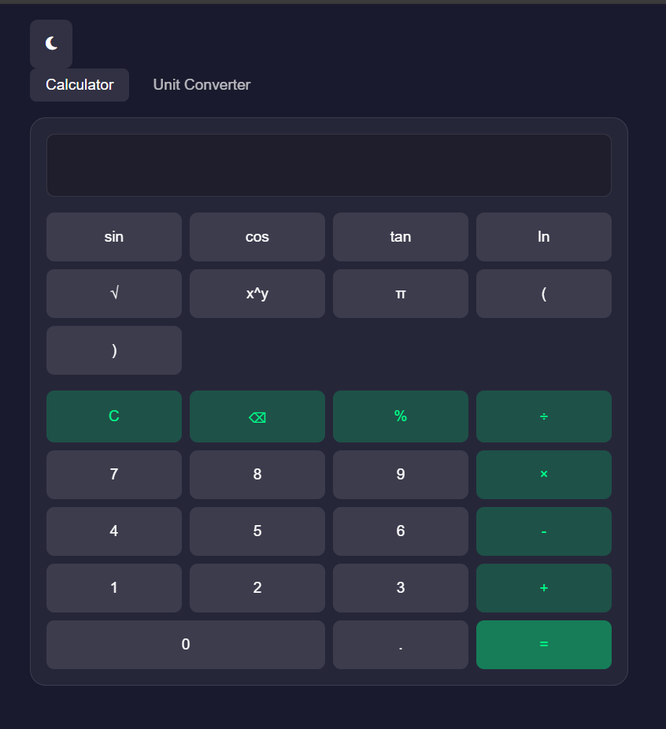

# 🚀 Tarun D | Full-Stack Developer Portfolio [](https://github.com/TarunD-code/My-Portfolio)

[](https://linkedin.com/in/tarun-d-6baa66218)
[](https://github.com/TarunD-code)
[](mailto:tarungjsheela@gmail.com)


## 👨💻 Technical Profile
**Former Technical Support Engineer** transitioning to full-stack development with expertise in:
- **Backend**: Java 24, Spring Boot 3.1, REST APIs
- **Frontend**: JavaScript (ES6+), HTML5, CSS3
- **Tools**: Maven, Git, VS Code, Eclipse

---

## 🛠️ Featured Projects

### 💻 E-commerce Ecosystem
<details>
<summary>📸 Screenshots</summary>
  
| Payment Service | Cart System | Product Catalog |
|-----------------|-------------|-----------------|
|  |  |  |

</details>

**Key Components**:
- `MavenPaymentService`: Transaction processing engine
- `Ecommerce-Purple App`: Frontend UI with real-time updates
- `MessageQueueProcessor`: Async task handling

**[Explore Code →](./Eclipse%20IDE%20Projects/Maven%20Projects)**

---

### 🎮 Interactive Web Apps
<details>
<summary>🕹️ Game Previews</summary>

| Snake Game | Tic Tac Toe | Car Race |
|------------|-------------|----------|
|  |  |  |

</details>

**Tech Stack**: Vanilla JavaScript, CSS Animations, Local Storage

**[Try Live Demos →](./VS%20Code%20Projects/Frontend%20Games)**

---

## 📂 Repository Structure


---

## 🔧 How to Navigate
1. Click project names to view source code
2. Expand 📸 Screenshots sections for visuals
3. Use badges to connect via professional networks

---

---

## 🖼️ Visual Portfolio

<details>
  <summary>📂 Click to Explore Project Screenshots</summary>
  
  ### Ecommerce Frontend
  
  
  
  ### Web Applications
   
</details>

---

## 📌 Key Features

✅ **Backend Expertise**  
- Payment processing with retry logic  
- Message queue implementation  
- Inventory management system  

✅ **Frontend Skills**  
- Responsive UI design  
- Interactive web components  
- State management with JS  

---

## 📫 Let's Connect

[](mailto:tarungjsheela@gmail.com)
[](https://tarund-code.github.io)
[](https://medium.com/@tarund)


## 📈 Technical Evolution
```mermaid
graph TD
    A[Technical Support] --> B(Javascript, HTML, CSS)
    B(Java Core)
    B --> C[Java Core]
    C --> D[Spring Boot]
    D --> E[Payment Systems]
    E --> F[E-commerce Architecture]
    F --> G[Full-Stack Development]


